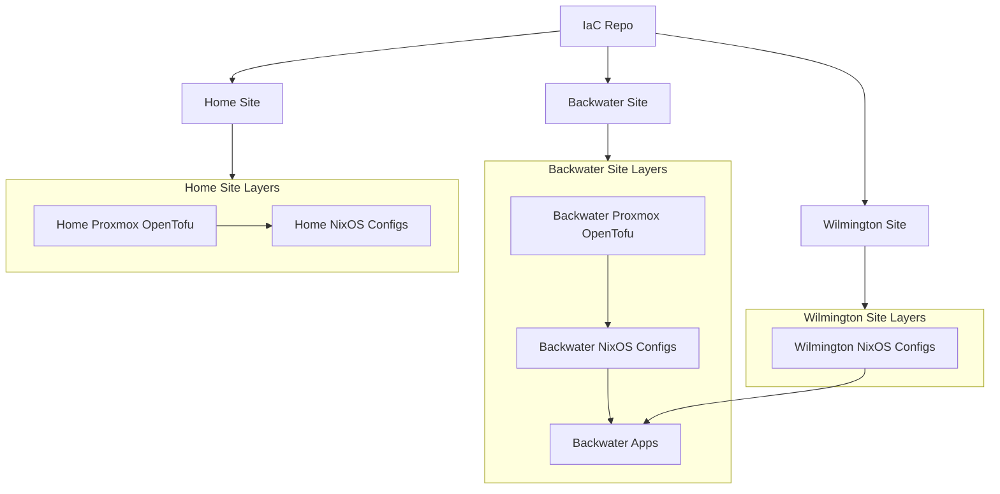

 # IaC Homelab Overview

 This repository showcases what **Infrastructure as Code (IaC)** can bring to a homelab: centralized service management, easier scaling across multiple sites, and a mostly-universal, declarative language for deploying infrastructure and applications that “just works” most of the time.

 The repo models a buttoned‑up infrastructure with DNS, DHCP, identity, observability, and storage, plus a growing set of applications (media, data, gaming, AI, and more) — all described as code.

 ## Architecture at a Glance

 - **Provisioning & virtualization (Proxmox + OpenTofu)**
   - Proxmox VE provides the hypervisor and SDN layers for each site.
   - OpenTofu (Terraform-compatible) in `00-proxmox/` defines VLANs/VNets, storage mappings, LXCs, and VMs declaratively.
 - **Operating system & services (NixOS)**
   - NixOS hosts are defined under `01-nix/` and turn Proxmox guests into concrete roles: DNS, DHCP, VPN, identity, observability, application servers, and more.
   - Firewall rules, users/groups, and service wiring are all expressed as code.
 - **Application layers**
   - Higher-level services (Kubernetes add‑ons, media stacks, data platforms, Minecraft, etc.) are layered on top of NixOS hosts, reusing the same IaC patterns across sites.

 Together, these layers make it possible to spin up, rebuild, or extend homelab infrastructure in a repeatable way, with a single source of truth in git.

 ## Repository Structure

 At the top level, the repo is organized by **site**, then by **layer** within each site:

 - **`site-backwater/` – Backwater site (primary homelab)**
   - Proxmox-based environment hosting most core infrastructure and heavier workloads.
   - Layers:
     - `site-backwater/00-proxmox/`: OpenTofu for Proxmox SDN, storage, LXCs, and VMs.
     - `site-backwater/01-nix/`: NixOS configs for LAN_Server, DMZ, and supporting services.
   - Entry point: see [`site-backwater/README.md`](site-backwater/README.md) for a detailed architecture overview (networking, storage tiers, security, and application roles).

 - **`site-home/` – Home site**
   - Smaller Proxmox environment focused on core home‑network services (DNS, DHCP, reverse proxy, tunnels) with a limited set of applications.
   - Layers:
     - `site-home/00-proxmox/`: OpenTofu definitions for the home Proxmox node, networks, and guests.
     - `site-home/01-nix/` (if present): NixOS and service configs reusing the same patterns as backwater.
   - Entry point: see [`site-home/README.md`](site-home/README.md) for home‑site specifics.

 - **`site-wilmington/` – Wilmington site (peer site)**
   - Additional site that participates in cross‑site networking (e.g., via WireGuard tunnels) and selected services.
   - Layers mirror the same pattern where present (`00-proxmox/` for provisioning, `01-nix/` for NixOS and services).

 Within each site:

 - **`00-proxmox/` – Infrastructure provisioning**
   - Defines Proxmox resources (storage, networks, LXCs, VMs) using OpenTofu.
   - Encodes how hosts are attached to VLANs/VNets, which storage tiers they use, and their sizing.
 - **`01-nix/` – NixOS & services**
   - Defines what runs on each host: operating system options, services, firewall rules, identity integration, and observability.
   - Subdirectories (e.g., `LAN-server/`, `DMZ/`) group machines by role and trust zone.

 ## What This Repo Demonstrates

 - **Centralized service management**
   - DNS, DHCP, identity, observability, and core applications are all modeled as code and deployed consistently across sites.
 - **Scaling and repeatability**
   - Adding a new host, service, or site is mostly a matter of cloning existing patterns in OpenTofu + NixOS rather than manual clicks.
 - **Universal deployment language**
   - A single IaC approach (OpenTofu + NixOS + a bit of Kubernetes where needed) describes everything from bare VMs and containers to high‑level apps.
 - **Buttoned‑up homelab**
   - The repo demonstrates how to run a homelab with production‑style practices: clear network segmentation, repeatable builds, and minimal snowflake hosts.

 ## How to Navigate Next

 - **For the most complete example**, start with [`site-backwater/README.md`](site-backwater/README.md) to see how a full‑featured homelab site is layered.
 - **For a simpler footprint**, read [`site-home/README.md`](site-home/README.md) to see how the same patterns apply to a smaller environment.
 - **For specific layers**, dive into:
   - `*/00-proxmox/` for Proxmox/OpenTofu provisioning details.
   - `*/01-nix/` (especially `site-backwater/01-nix/README.md`) for NixOS service composition and cross‑site interactions.

